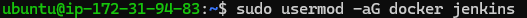
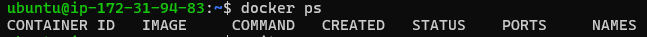
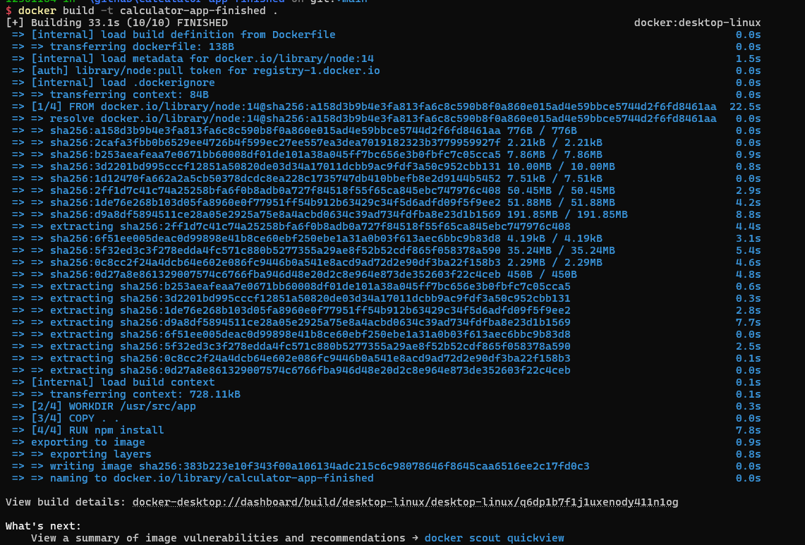
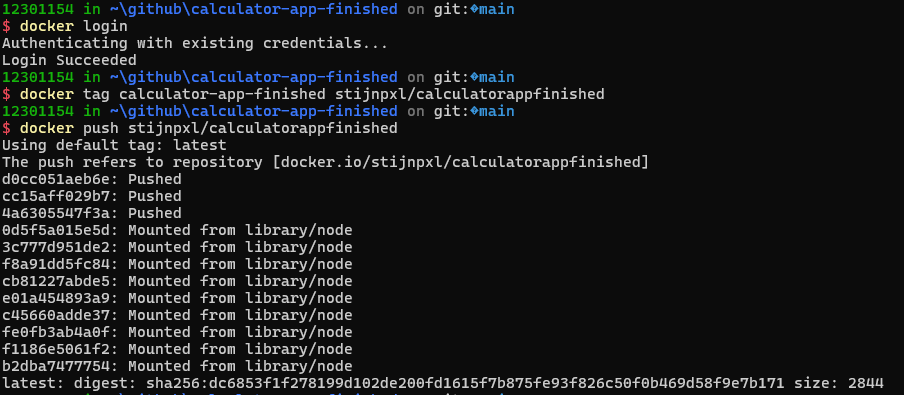
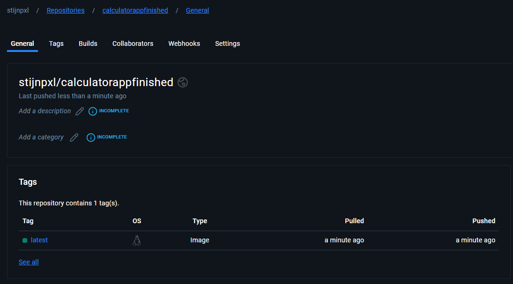
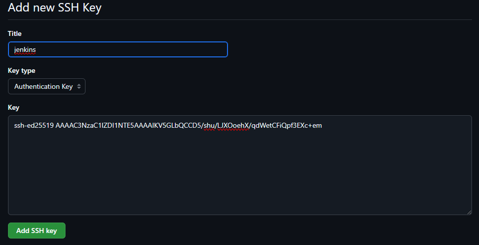
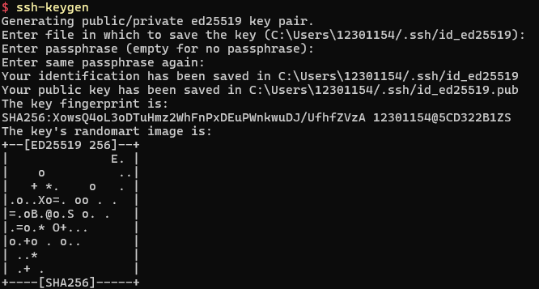
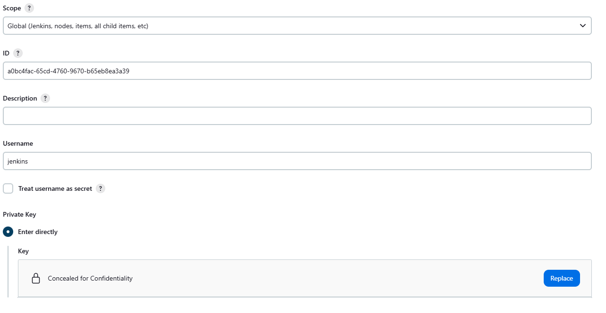
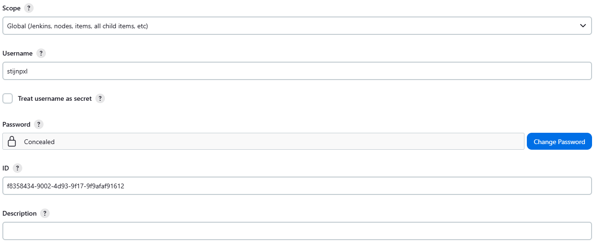

Vul onderstaande aan met de antwoorden op de vragen uit de readme.md file. Wil je de oplossingen file van opmaak voorzien? Gebruik dan [deze link](https://github.com/adam-p/markdown-here/wiki/Markdown-Cheatsheet) om informatie te krijgen over
opmaak met Markdown.

a)

github

docker

b)
