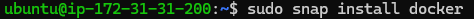
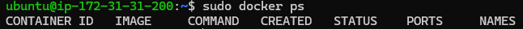
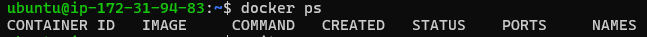
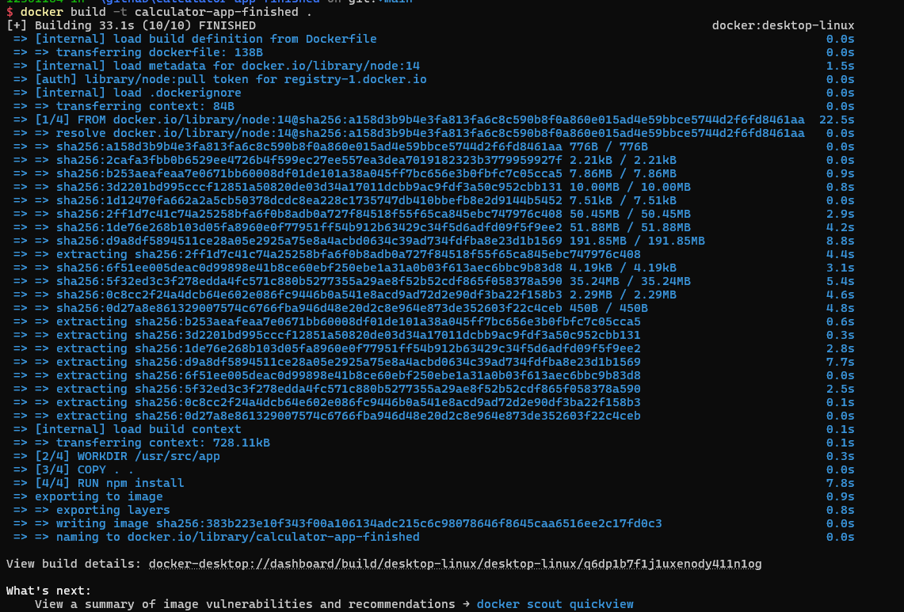
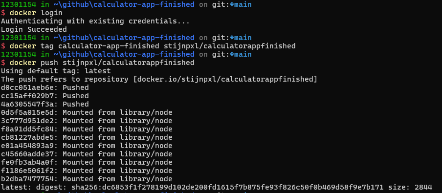
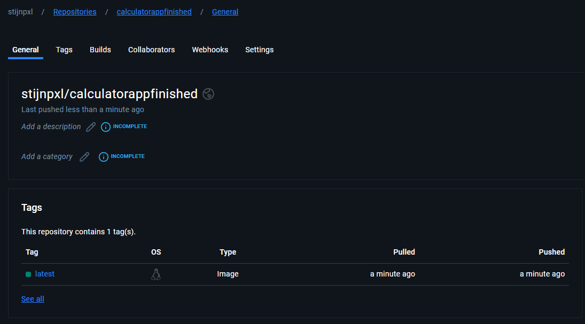
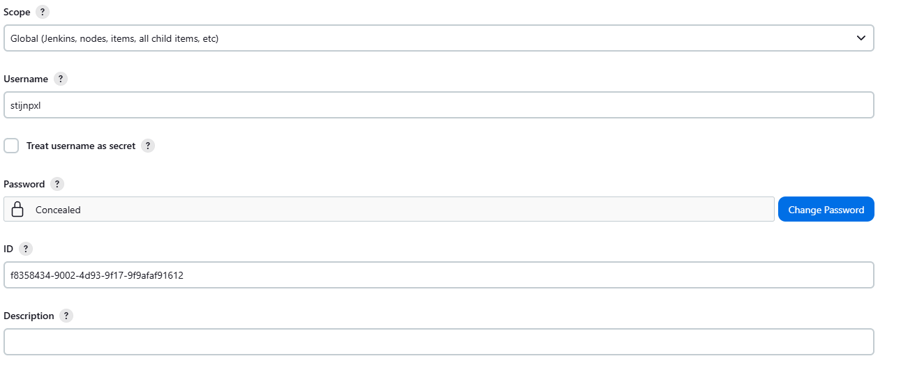
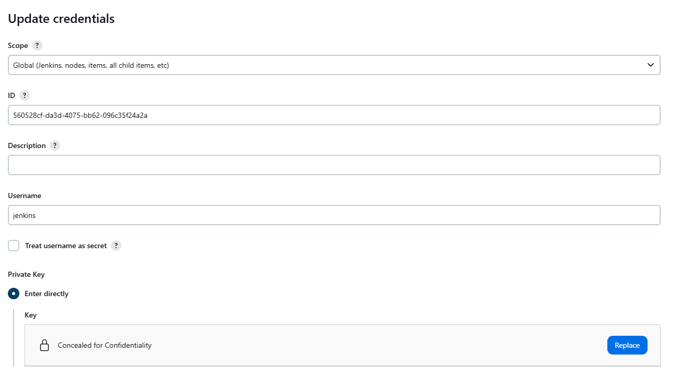

Vul onderstaande aan met de antwoorden op de vragen uit de readme.md file. Wil je de oplossingen file van opmaak voorzien? Gebruik dan [deze link](https://github.com/adam-p/markdown-here/wiki/Markdown-Cheatsheet) om informatie te krijgen over
opmaak met Markdown.

a)

Om docker te kunnen gebruiken in jenkins moeten we eerst docker installeren. We doen dit aan de hand van volgende commando's:

Hier updaten we onze ubuntu server zodat alles up-to-date is.

Met dit commando installeren we docker.

Door het volgende commando uit te voeren kunnen we zien dat docker werkt met sudo.

Als we deze commando's uitvoeren geven we permissies aan de jenkins gebruiker om docker te gebruiken zonder sudo.

Hier testen we docker zonder sudo.

Deze stappen doen we nog een keer voor de productie server maar dan met de naam ubuntu i.p.v jenkins.

Nu onze servers docker kunnen gebruiken moeten we de docker image op docker hub plaatsen.

Eerst builden we de docker image van de calculator app.

Nu loggen we in op docker hub. Daarna taggen we de image met het docker hub account en pushen we deze vervolgens naar docker hub.

Hier is een foto van de docker image op docker hub.

Om de dockerfile te kunnen gebruiken moeten wij credentials aanmaken met de gebruikersnaam en het wachtwoord van docker hub zoals in onderstaande foto.

Voor de connectie met de production server moeten wij nog eens credentials aanmaken waarbij we de vockey kopieeren en plakken in de Private Key sectie van de credentials.

Nu kunnen we beginnen aan de pipeline te schrijven.

b)
